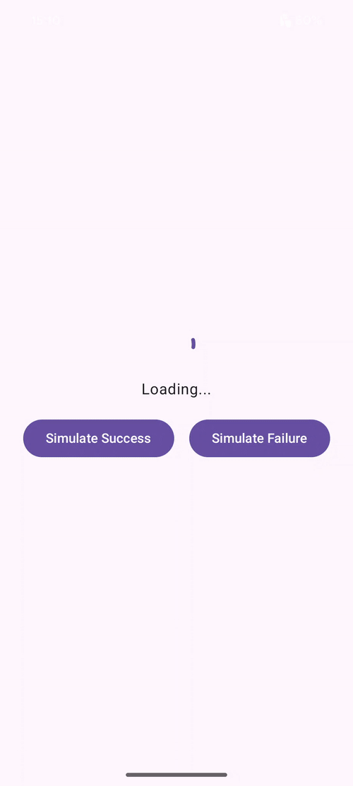

This is an example project showing off a state machine with a simple UI to show off its capabilities.
This is the initial branch, make sure to check out all the other branches as well!

This is the list of articles:

* [Model View State Machine: MVS](https://proandroiddev.com/model-view-state-machine-mvs-7dc371275b60)
* [MVS series: Building the State Machine](https://proandroiddev.com/mvs-series-building-the-state-machine-104e051c1497) <--
  you are here
* MVS series: Implementing side effects (Coming soon)
* MVS series: Creating nested states (Coming soon)
* MVS series: State Machine usage and reusable patterns (Coming soon)

The demo shows that you can control the following flow:
1. Load form data, with error handling
2. Manipulate data
3. Save the data with again proper error handling
4. Show the success screen

This is a Kotlin Multiplatform project targeting Android, Web, Desktop (JVM).

* [/composeApp](./composeApp/src) is for code that will be shared across your Compose Multiplatform applications.
  It contains several subfolders:
  - [commonMain](./composeApp/src/commonMain/kotlin) is for code that’s common for all targets.
  - Other folders are for Kotlin code that will be compiled for only the platform indicated in the folder name.
    For example, if you want to edit the Desktop (JVM) specific part, the [jvmMain](./composeApp/src/jvmMain/kotlin)
    folder is the appropriate location.

Learn more about [Kotlin Multiplatform](https://www.jetbrains.com/help/kotlin-multiplatform-dev/get-started.html),
[Compose Multiplatform](https://github.com/JetBrains/compose-multiplatform/#compose-multiplatform),
[Kotlin/Wasm](https://kotl.in/wasm/)…

You can open the desktop app with hot reload by hitting the "play" button in the gutter inside desktop's Main.kt file.
You can also open the web application by running the `:composeApp:wasmJsBrowserDevelopmentRun` Gradle task.
